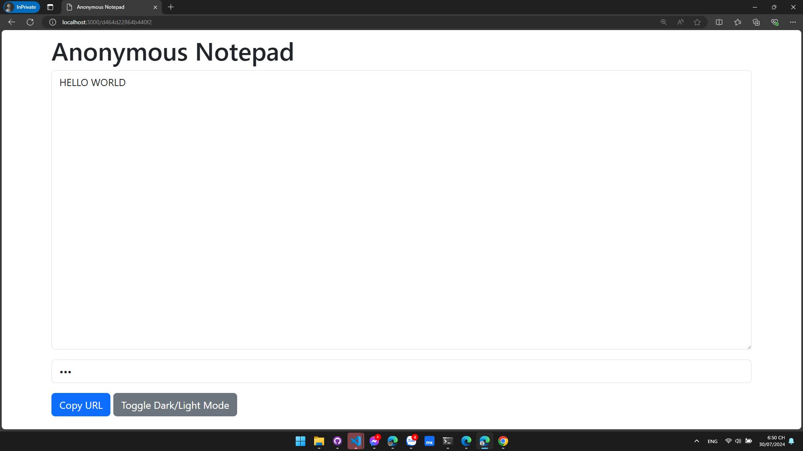
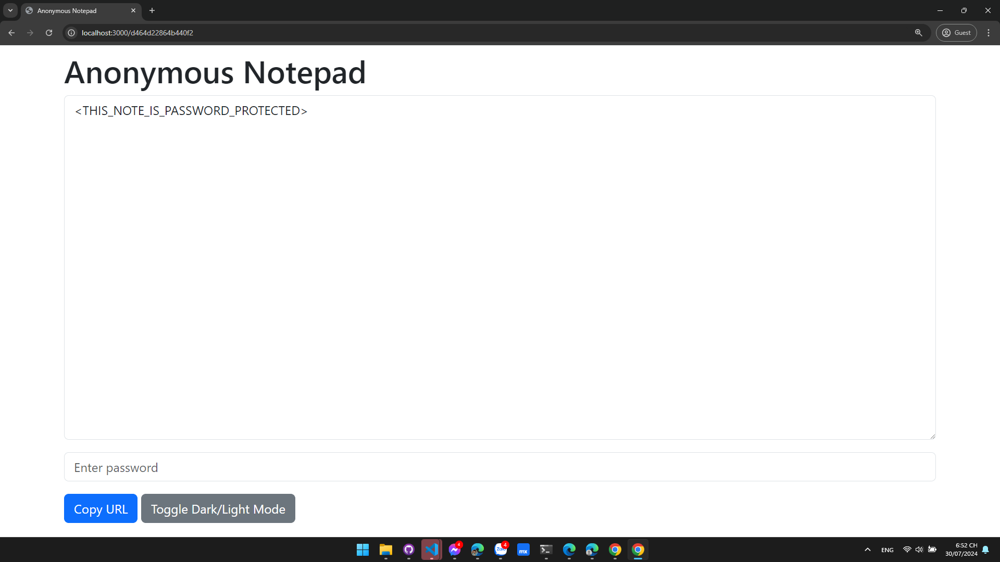

<h1 align="center">
	Anonymous Notepad
</h1>

<p align="center">
	<strong>Anonymous Notepad is a simple web application that allows users to create and share notes with a unique URL.</strong>
</p>

## 🚀 Installation
1. Clone the repository
```bash
git clone https://github.com/ntkhang03/Anonymous-Notepad/ && cd Anonymous-Notepad
```
2. Install dependencies
```bash
npm install
```
3. Start the server
```bash
npm start
```

## 👀 Features
- Create a note with a unique URL
- Share the note with others
- View/Edit the note without any sign-in or sign-up
- Customizable note URL
- Custom password protection for the note
- Dark mode support

## 🛡️ How to use password protection?
- Just device that created the note can set the password for the note
- To set the password for the note, easily enter the password in the password field, system will automatically encrypt the password
- When you want to share the note, just share the note URL and the password with others




## 💡 Development ideas
- Add a feature to allow users to set the expiration time for the note
- Add a feature to allow users to set the note to be destroyed after reading
- Add a feature to allow users to set the note to be destroyed after a certain number of views
- ...

## 🚀 Technologies
- [Node.js](https://nodejs.org/)
- [Express](https://expressjs.com/)
- [EJS](https://ejs.co/)
- [Sequelize](https://sequelize.org/)